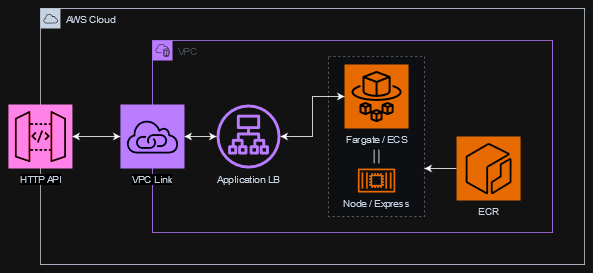
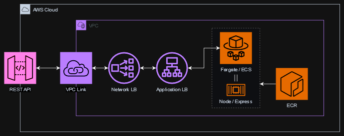

# apigw-fargate-stacks

Demo application for an AWS Fargate stack, without needing your own domain and certificate.

## TL;DR

- ✔️ Requests can be securely routed through API Gateway to a containerised Express server behind a
  private load balancer
- ✔️ Secure cookies work fine with HTTP API Gateway and a little Express wrangling
- ❌ Secure cookies will not make it through REST API Gateway

## Contents

* [Motivation](#motivation)
* [The Problem: Remote Development Environment](#the-problem-remote-development-environment)
* [The Solution?](#the-solution)
  * [1. HTTP API](#1-http-api)
  * [2. REST API](#2-rest-api)
* [Try It Yourself](#try-it-yourself)
  * [Install dependencies](#install-dependencies)
  * [Run the application locally](#run-the-application-locally)
  * [Deploy the stacks](#deploy-the-stacks)
    * [Prerequisites](#prerequisites)
    * [Commands](#commands)

## Motivation

While working on the [Prompt Injection Mitigation](https://github.com/ScottLogic/prompt-injection)
repo, I was tasked with generating infrastructure-as-code templates for deploying resources to AWS.
The project has a standard React [SPA](https://en.wikipedia.org/wiki/Single-page_application) UI,
and a containerised [Node Express](https://www.npmjs.com/package/express) back-end. For the
infrastructure, I am using
[AWS CDK framework](https://docs.aws.amazon.com/cdk/v2/guide/home.html) as it makes the stacks
super-easy and even _enjoyable_ to define! Not something you can say about any of the YAML-based
template solutions (yes I'm talking about you:
[CloudFormation](https://docs.aws.amazon.com/AWSCloudFormation/latest/UserGuide/gettingstarted.templatebasics.html),
[Terraform](https://developer.hashicorp.com/terraform),
[Serverless](https://www.serverless.com/framework/docs/providers/aws/guide/serverless.yml)
et al).

For the UI, it is trivial to provision and deploy our bundle to an S3 bucket behind
[CloudFront](https://docs.aws.amazon.com/AmazonCloudFront/latest/DeveloperGuide/Introduction.html.
But the API has a stumbling block: we are using a
[Secure Cookie](https://developer.mozilla.org/en-US/docs/Web/HTTP/Headers/Set-Cookie#secure) to pass
a session ID between UI and API, which Express will not send if it thinks the connection is insecure
(i.e. http not https). While you can tell Express to trust proxy servers in between, this currently
relies on
[X-Forwarded-* headers](https://developer.mozilla.org/en-US/docs/Web/HTTP/Headers/X-Forwarded-For)
being correctly added by the proxy server(s) to represent the client origin.

Our API stack will be using [AWS Fargate](https://aws.amazon.com/fargate/) to deploy and manage our
container, fronted by an Application Load Balancer (ALB), which does indeed append these headers.
Our production environment turns out to be rather flexible to configure, because in addition to the
ALB being _secure_ (so Express can trust it) we will be using our own domain for both UI and API
(via [Route53](https://aws.amazon.com/route53/faqs/)) meaning they are classified as
[SameSite](https://owasp.org/www-community/SameSite). This means our cookie doesn't even need to be
secure, which would be fine for us as all it contains is a session ID, nothing sensitive.

Running the application locally is also fine, because UI and API are both on localhost - also
classed as SameSite despite being on different ports (this ain't
[CORS](https://web.dev/articles/same-site-same-origin), folks).

## The Problem: Remote Development Environment

This all sounds lovely, but we don't yet have a subdomain registered for our application. We might
decide to buy a fancy domain of its own, and use [ACM](https://aws.amazon.com/certificate-manager/)
for hassle-free certificate management, or we might choose to register a subdomain of
[scottlogic.com](https://scottlogic.com). In either case we want to show we can deploy our
application to AWS, fully functional and robust, until we have an application ready to Go Live. And
of course tear it down again super-fast.

We won't want to expose our ALB publicly if it is insecure, which leaves us needing some sort of
secure proxy in front. Step forward, [API Gateway](https://docs.aws.amazon.com/apigateway/)!

## The Solution?

There are now two ways to route traffic through API Gateway to a containerised server fronted by a
load balancer.

### 1. HTTP API



The newer [HTTP API](https://docs.aws.amazon.com/apigateway/latest/developerguide/http-api.html)
from API Gateway is lightweight and costs less than REST API, and as a distinct bonus, it supports
integration with ALB. For this, we define a
[VPC Link](https://docs.aws.amazon.com/apigateway/latest/developerguide/http-api-vpc-links.html) to
access the ALB within our
[Virtual Private Cloud (VPC)](https://docs.aws.amazon.com/vpc/latest/userguide/what-is-amazon-vpc.html).
It all fits together pretty smoothly, despite a hiccup or two with Security Groups.

But gosh darn, it turns out we have a disagreement between AWS services. Crucially, it's a
disagreement about which headers to use for identifying client origin and proxies along the route.
HTTP API uses the new "standardized"
[Forwarded header](https://developer.mozilla.org/en-US/docs/Web/HTTP/Headers/Forwarded), whereas ALB
uses the
[X-Forwarded- headers](https://developer.mozilla.org/en-US/docs/Web/HTTP/Headers/X-Forwarded-For)
which MDN describes as "de-facto standard headers" ... Confused? Me too! But the end result is that
our server receives both flavours of header, and even if Express was respecting the Forwarded
header, which it currently isn't, it wouldn't know how to combine the headers to reproduce the
correct order of client and proxies along the route. Furthermore, for good reason HTTP API does not
allow adding or modifying either of these
[reserved headers](https://docs.aws.amazon.com/apigateway/latest/developerguide/http-api-parameter-mapping.html#http-api-mapping-reserved-headers),
so we cannot even map the values from one header to the other.

So we're
[up shit creek](https://repost.aws/questions/QUtBHMaz7IQ6aM4RCBMnJvgw/why-does-apigw-http-api-use-forwarded-header-while-other-services-still-use-x-forwarded-headers)
then? Not quite... The lovely folks at Express provide what you might call
[a bypass](http://expressjs.com/en/guide/overriding-express-api.html) to rewrite properties that
Express itself derives from the incoming request. Luckily for us, two of these properties are
[ip and protocol](http://expressjs.com/en/5x/api.html#req.ip). By default, Express derives the
values of these from the X-Forwarded headers when they exist (and "trust proxy" is set), so because
we know we are receiving the Forwarded header instead, we can parse it to extract and set the ip and
protocol, ignore the X-Forwarded headers entirely, and fall back to default values derived from the
request when the Forwarded header is not found.

Easy when you know how, and ... OMG it actually works! 🥳

### 2. REST API



Before HTTP API arrived, you could integrate a public
[REST API](https://docs.aws.amazon.com/apigateway/latest/developerguide/apigateway-rest-api.html)
with a
[Network Load Balancer (NLB)](https://docs.aws.amazon.com/elasticloadbalancing/latest/network/introduction.html)
inside a VPC, by defining a
[VPCLink](https://docs.aws.amazon.com/apigateway/latest/developerguide/set-up-nlb-for-vpclink-using-console.html).
The NLB will route traffic to the ALB, which in turn routes it to your container(s). That's a lot
of services (and costs) and a fair amount of config, so it's far from ideal. But despite a few
gotchas along the way, it is possible.

However, it turns out this stack has a showstopper for our secure cookies use case: either REST API
is not adding our secure client to the X-Forwarded headers (and REST API does not support modifying
headers with a
[proxy integration](https://docs.aws.amazon.com/apigateway/latest/developerguide/apigateway-override-request-response-parameters.html)),
or the NLB is not preserving those headers along the way (which seems unlikely as NLB is a Transport
Layer), but in either case there is no way to tell our server it is behind a secure, trusted proxy,
and that the request originated from a secure client. So while we can successfully route our
requests, we cannot transmit secure cookies, so we cannot preserve sessions.

I have not had time to fully investigate using only a NLB without an ALB to route to our Fargate
container, but I do recall the first time I tried, I was unable to get my healthcheck working
correctly, so I switched to ALB.
[Using proxy protocol on our Target Groups](https://docs.aws.amazon.com/elasticloadbalancing/latest/network/load-balancer-target-groups.html#proxy-protocol)
looks somewhat promising, if you want to give it a try.

The bottom line: this time we really are up shit creek 🛶


## Try It Yourself

You can run the UI and API locally, to see how it _should_ work.
You can then deploy the two flavours of stack to your AWS account and see it working / breaking
respectively.

### Install dependencies

```
# From this directory:
npm install
```

### Run the application locally

```
# Run these in separate terminals:
npm run start:api
npm run start:ui
```

### Deploy the stacks

#### Prerequisites

If you have not used
[AWS CLI](https://docs.aws.amazon.com/cli/latest/userguide/getting-started-install.html) before, you
will need to install it and then
[configure a profile](https://docs.aws.amazon.com/cli/latest/userguide/getting-started-install.html).

If you have not used CDK to manage your resources before, you will need to
[bootstrap your AWS environment for CDK](https://docs.aws.amazon.com/cdk/v2/guide/bootstrapping.html).
See the
[cloud README](./cloud/README.md) for the commands you'll need.

#### Commands

Refer to the [cloud README](./cloud/README.md). In simplest terms: synth, deploy, test ... destroy!

Once the stacks are deployed, you should see the Site URL output on command-line, or you can log
into the AWS console and find your distribution in CloudFront. Open the URL in your browser, and
click away! Then open the URL in a different browser, or a private window, and see what happens...
When it works, each browser or private tab will have its own independent session, and the current
state is restored on page refresh. When sessions are broken, you'll likely see the counter becomes
stuck on 1.
